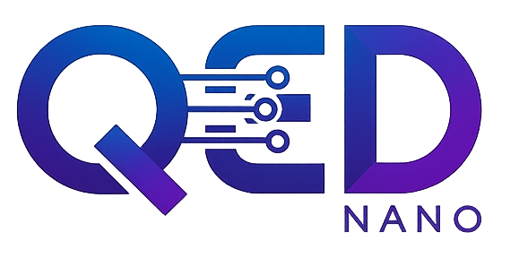

<div align="center">
    <h1><br>QED-Nano</h1>

  <a href="https://www.python.org/">

  </a>
  <a href="https://opensource.org/licenses/Apache-2.0">

  </a>
  <a href="https://huggingface.co/lm-provers">

  </a>
</div>

# QED-Nano: Nearing Gemini 3 Pro on Olympiad Math Proofs with a 4B Model

QED-Nano is a compact 4B-parameter language model explicitly post-trained for Olympiad-level mathematical proof generation. By combining high-quality supervised fine-tuning with long-horizon reinforcement learning and structured test-time compute, QED-Nano significantly strengthens proof-writing capabilities in small models.

Despite its size, QED-Nano closes much of the gap to large generalist systems by learning to reason over long horizons and effectively utilize additional computation at inference time. The training pipeline emphasizes data quality, curriculum design, and reinforcement learning objectives that directly optimize for rigorous step-by-step proof correctness.

This repository contains the full training and evaluation stack for QED-Nano, including curated Olympiad proof datasets, supervised fine-tuning and reinforcement learning code, and benchmarking tools for proof and answer-based evaluations. The goal is to provide a reproducible framework for studying long-horizon mathematical reasoning in compact language models and for enabling future research on compute-efficient reasoning systems.

## 🚀 Quick Links

- **Model**: [lm-provers/QED-Nano](https://huggingface.co/lm-provers/QED-Nano) on Hugging Face
- **Blog Post**: [QED-Nano: Nearing Gemini 3 Pro on Olympiad Math Proofs with a 4B Model](https://www.notion.so/QED-Nano-Nearing-Gemini-3-Pro-on-Olympiad-Math-Proofs-with-a-4B-Model-2bd1951bd76780b4bcd5e6b25e34493d)

## 📦 Training Data

- **SFT Data**: [lm-provers/FineProofs-SFT](https://huggingface.co/datasets/lm-provers/FineProofs-SFT)
- **RL Data**: [lm-provers/FineProofs-RL](https://huggingface.co/datasets/lm-provers/FineProofs-RL)

## 📂 Repository Structure

This repository contains the code and resources for training and evaluating QED-Nano:

- **`data/`** - Data generation scripts and SLURM configurations for creating SFT and RL training datasets
- **`training/`** - Training code for supervised fine-tuning (SFT) and reinforcement learning (RL) with reasoning cache
- **`eval/`** - Evaluation code for benchmarking models on IMOProofBench, IMOAnswerBench, and ProofBench


## 🏃 Getting Started

### Data Generation

For instructions on generating dataset used in this codebase, see the [data README](data/README.md)


### Training

For instructions on training your own model using our codebase and datasets, see the [training README](training/README.md).

### Evaluation

For instructions on evaluating models on our benchmarks, see the [evaluation README](eval/README.md).


## 📊 Citation

If you use QED-Nano in your research, please cite:

```bibtex
@article{qednano2026,
  title={QED-Nano: Nearing Gemini 3 Pro on Olympiad Math Proofs with a 4B Model},
  author={},
  journal={},
  year={2026}
}
```

